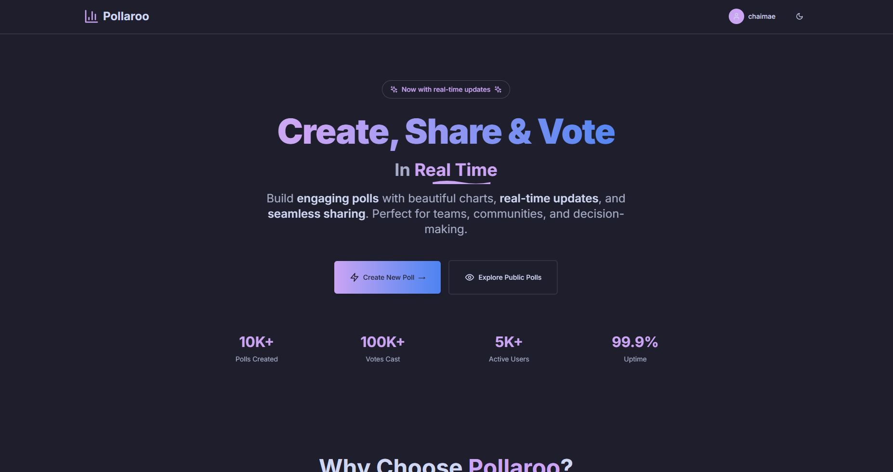
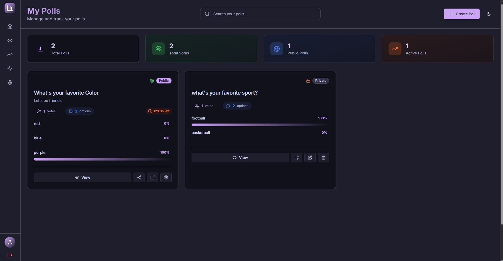

# Pollaroo - Interactive Polling Platform

A modern, full-stack polling application that allows users to create, share, and participate in interactive polls. Built with Django REST Framework and Next.js, featuring real-time voting, user authentication, and responsive design.

## 📸 Application Preview

<div align="center">
  
  <p><em>Homepage - Clean and modern interface</em></p>
</div>

<div align="center">
  
  <p><em>User Dashboard - Manage your polls</em></p>
</div>

<div align="center">
  
  <p><em>Poll Interface - Interactive voting experience</em></p>
</div>


## 🌟 Features

- 🗳️ **Create Polls**: Build polls with multiple options and settings
- ⚡ **Real-time Voting**: Live updates as votes come in
- 🔐 **User Authentication**: Secure JWT-based login system
- 📊 **Dashboard**: Personalized dashboard for managing your polls
- 🔗 **Easy Sharing**: Share polls with unique URLs
- 📱 **Mobile-First**: Responsive design for all devices
- 🎨 **Modern UI**: Clean interface with Tailwind CSS
- 🛡️ **Security**: Input validation and permission-based access

## 🛠 Technology Stack

### Backend
- **Django 4.2** - Python web framework
- **Django REST Framework** - API development
- **SQLite** - Database (easily replaceable with PostgreSQL/MySQL)
- **JWT Authentication** - Secure token-based authentication
- **CORS Headers** - Cross-origin resource sharing support

### Frontend
- **Next.js 14** - React framework with app router
- **TypeScript** - Type-safe JavaScript development
- **Tailwind CSS** - Utility-first CSS framework
- **Zustand** - Lightweight state management
- **React Hook Form** - Form handling with validation
- **Sonner** - Beautiful toast notifications

## 📁 Project Structure

```
alx-project-nexus/
├── backend/                    # Django backend application
│   ├── pollaroo/              # Django project configuration
│   │   ├── settings.py        # Project settings
│   │   ├── urls.py           # URL routing
│   │   └── ...
│   ├── polls/                 # Polls app
│   │   ├── models.py         # Poll, Option, Vote models
│   │   ├── views.py          # API endpoints
│   │   ├── serializers.py    # Data serialization
│   │   └── ...
│   ├── users/                 # User authentication app
│   │   ├── models.py         # User model extensions
│   │   ├── views.py          # Auth endpoints
│   │   └── ...
│   ├── requirements.txt       # Python dependencies
│   └── manage.py             # Django management script
├── frontend/                  # Next.js frontend application
│   ├── src/
│   │   ├── app/              # App router pages
│   │   │   ├── dashboard/    # User dashboard
│   │   │   ├── poll/         # Poll views
│   │   │   └── ...
│   │   ├── components/       # Reusable React components
│   │   │   ├── auth/         # Authentication components
│   │   │   ├── poll/         # Poll-related components
│   │   │   └── ui/           # UI components
│   │   ├── lib/              # Utility functions
│   │   │   ├── api.ts        # API client
│   │   │   └── utils.ts      # Helper functions
│   │   └── store/            # State management
│   ├── package.json          # Node.js dependencies
│   └── ...
└── README.md                 # Project documentation
```

## 🔧 API Endpoints

### Authentication
- `POST /api/auth/register/` - User registration
- `POST /api/auth/login/` - User login
- `POST /api/auth/logout/` - User logout
- `GET /api/auth/user/` - Get current user info

### Polls
- `GET /api/polls/` - List public polls (with search/filter)
- `POST /api/polls/` - Create new poll (authenticated)
- `GET /api/polls/{id}/` - Get poll details
- `PUT /api/polls/{id}/` - Update poll (owner only)
- `DELETE /api/polls/{id}/` - Delete poll (owner only)
- `GET /api/polls/user-polls/` - Get user's polls (authenticated)

### Voting
- `POST /api/polls/{id}/vote/` - Vote on a poll
- `GET /api/polls/{id}/results/` - Get poll results

## ⚠️ Development Status

**Current Phase:** Active Development  
While the core authentication system and API endpoints are functionally operational, some frontend-backend integration aspects are still being refined. The application demonstrates full-stack capabilities but may have intermittent communication issues that are actively being addressed.

## 🚀 Setup Instructions

### Prerequisites
- Python 3.8+ 
- Node.js 18+
- npm or yarn

### Backend Setup

1. **Clone the repository**
   ```bash
   git clone https://github.com/s-shemmee/alx-project-nexus.git
   cd alx-project-nexus/backend
   ```

2. **Create virtual environment**
   ```bash
   python -m venv venv
   source venv/bin/activate  # On Windows: venv\Scripts\activate
   ```

3. **Install dependencies**
   ```bash
   pip install -r requirements.txt
   ```

4. **Environment configuration**
   ```bash
   cp env.example .env
   # Edit .env with your configuration
   ```

5. **Database setup**
   ```bash
   python manage.py makemigrations
   python manage.py migrate
   python manage.py createsuperuser  # Optional: create admin user
   ```

6. **Run development server**
   ```bash
   python manage.py runserver
   ```

The backend API will be available at `http://localhost:8000`

### Frontend Setup

1. **Navigate to frontend directory**
   ```bash
   cd ../frontend
   ```

2. **Install dependencies**
   ```bash
   npm install
   # or
   yarn install
   ```

3. **Environment configuration**
   ```bash
   # Create .env.local file with:
   NEXT_PUBLIC_API_BASE_URL=http://localhost:8000
   ```

4. **Run development server**
   ```bash
   npm run dev
   # or
   yarn dev
   ```

The frontend will be available at `http://localhost:3000`

## 📖 Usage Guide

### For Users
1. **Registration**: Create account with username, email, and password
2. **Login**: Access your account with email/username and password
3. **Create Polls**: Use the dashboard to create new polls with multiple options
4. **Share Polls**: Share poll URLs with others for voting
5. **Vote**: Participate in polls and see real-time results
6. **Manage**: View, edit, or delete your created polls from the dashboard

### For Developers
1. **API Testing**: Use the Django REST Framework browsable API at `/api/`
2. **Admin Panel**: Access Django admin at `/admin/` with superuser credentials
3. **Database**: SQLite database file is created automatically
4. **Debugging**: Check browser console and Django logs for debugging

## 🛡️ Security Features

- **JWT Tokens**: Secure authentication with refresh tokens
- **CORS**: Properly configured cross-origin requests
- **Input Sanitization**: Protection against common web vulnerabilities
- **Permission Checks**: Proper authorization for all API endpoints
- **Data Validation**: Frontend and backend validation for data integrity

## 🤝 Contributing

1. Fork the repository
2. Create a feature branch (`git checkout -b feature/amazing-feature`)
3. Commit your changes (`git commit -m 'Add some amazing feature'`)
4. Push to the branch (`git push origin feature/amazing-feature`)
5. Open a Pull Request

## 📄 License

This project is licensed under the MIT License - see the [LICENSE](LICENSE) file for details.

## 👨‍💻 Contact

- **Developer**: ALX Software Engineering Student
- **Repository**: [https://github.com/s-shemmee/alx-project-nexus](https://github.com/s-shemmee/alx-project-nexus)
- **Project**: Full-Stack Polling Application
- **Purpose**: Portfolio project demonstrating full-stack development skills

---

*Built with ❤️ using Django and Next.js*
